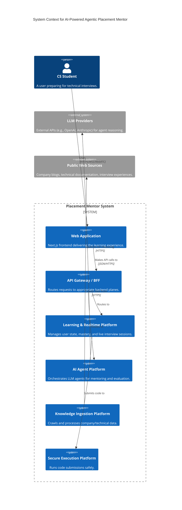

# 01. System Context Architecture

## 1. Introduction
The "AI-Powered Agentic Placement Mentor" is an advanced learning platform designed to help computer science students prepare for technical interviews and placements. It provides personalized, company-specific preparation using multi-agent orchestration, robust knowledge tracing, secure code execution, and RAG over targeted interview materials.

## 2. High-Level Architecture Planes
The architecture is structured around five major logical planes:

### PLANE A — Student / Learning Platform
The core platform for user management, learning progress, and assessment.
- **Responsibilities**: User profiles, target company/role configuration, question banks, assessment workflows, student mastery modeling, personalized roadmaps, and interview history.
- **Primary Consumers**: Students via the Frontend application.

### PLANE B — AI / Agent Platform
The LangGraph-powered orchestration engine.
- **Responsibilities**: Agent routing, code evaluator agents, system design mentors, knowledge tracing analysis, question/feedback generation, and persistent agent states (checkpoints).
- **Constraints**: Agents interact with the system via explicitly defined APIs and tools. They do not access the database directly.

### PLANE C — Knowledge Acquisition Platform
The web ingestion and document processing pipeline.
- **Responsibilities**: URL discovery, crawl scheduling (Crawl4AI), document extraction, normalization, classification, deduplication, chunking, and embedding.
- **Data Products**: Populates the Vector Store (MongoDB) and Object Storage (S3).

### PLANE D — Secure Execution Platform
The isolated code evaluation environment.
- **Responsibilities**: Running untrusted student code submissions safely.
- **Technologies**: Judge0 inside Firecracker microVMs.
- **Constraints**: Enforces strict CPU, memory, time, network, and process limits to prevent abuse.

### PLANE E — Realtime Platform
The synchronous communication infrastructure.
- **Responsibilities**: Text streaming, session presence, live interview events (WebSockets), and real-time audio signaling (WebRTC).

## 3. Context Diagram (C4 Level 1)

## 4. Key External Interfaces
- **Students**: Interact with the system via web browsers and mobile clients.
- **LLM APIs**: Provide foundational intelligence, reasoning, and content generation capabilities.
- **Web Sources**: The unstructured data source (canonical web pages, blogs) for the RAG knowledge base.
