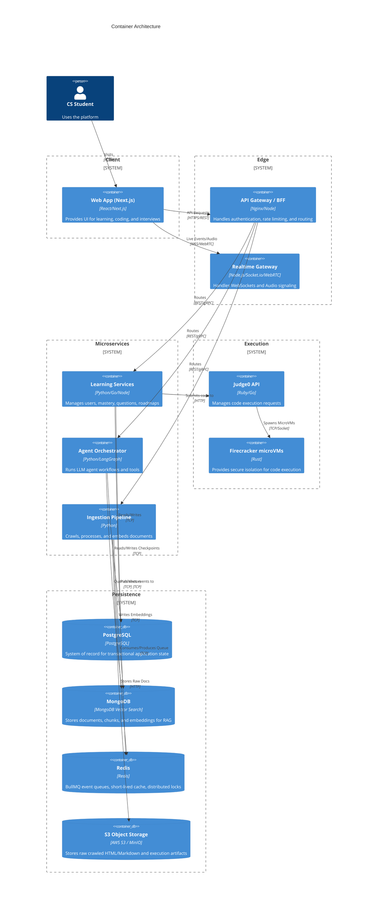

# 02. Container Architecture

## 1. Introduction
The Container Architecture defines the high-level technical deployments that make up the AI-Powered Agentic Placement Mentor. The system follows a modular microservices approach grouped by bounded contexts, utilizing Next.js for the frontend, robust backend services, and specialized infrastructure containers for distinct workloads.

## 2. Container Diagram (C4 Level 2)

## 3. Technology Stack Justification
- **Frontend (Next.js)**: Enables Server-Side Rendering (SSR) for fast initial loads, SEO, and robust integration with rich interactive components like code editors and WebRTC audio players.
- **Relational Database (PostgreSQL)**: Serves as the strict system of record for highly structured, transactional data (users, mastery, assessments). Supported by PostgresSaver for LangGraph persistence.
- **Vector Store (MongoDB)**: MongoDB Vector Search handles RAG document storage, vector similarity search, and rich metadata filtering natively in one location.
- **Cache & Message Broker (Redis)**: Facilitates short-lived state, rate limiting, and BullMQ queues for asynchronous jobs (crawling, evaluation, embeddings).
- **Object Storage (S3)**: Acts as the definitive repository for raw ingestion artifacts to preserve exact provenance, allowing data to be reprocessed or re-embedded without triggering new web crawls.
- **Orchestration (LangGraph)**: Provides native support for multi-agent cyclic graphs, state management, and persistent checkpoints essential for complex mentoring conversations.
- **Execution Engine (Judge0 + Firecracker)**: Ensures enterprise-grade security against malicious student code by isolating execution within hardened microVMs with strict resource ceilings.
